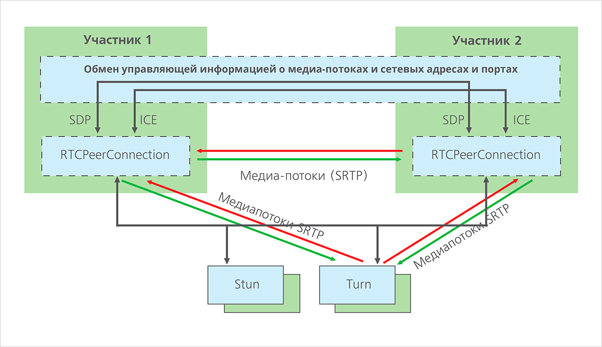

# mipt-networks-architecture

Репозиторий для домашней работы по курсу Архитектура компьютерных сетей [Петров Алексей].

## Описание

WebRTC (Web Real Time Communications) — это стандарт, который описывает передачу потоковых аудиоданных, видеоданных и контента между браузерами (без установки плагинов или иных расширений) или другими поддерживающими его приложениями в режиме реального времени. Данная технология позволяет превратить браузер в оконечный терминал видеоконференцсвязи.



Разделить технологию можно на 4 части

    - Signaling. Обмен в произвольной форме (Websocket, http, copy/paste) текстом в формате SDP.
    Указывается основная информация о клиенте (адреса для возможного соединения, сертификат для шифрования, описание медиа ресурсов)
    В данном проекте Signaling перенесен на сторону клиента, он любым способом передает offer/answer.

    - STUN/TURN сервера. Для получения адресов для возможного соединения. Основная идея - получить внешний IP,
    а в случае если для клиента недоступно получение пакетов с произвольного адреса, проксировать данные клиенту.
    В качестве stun сервера используется сервер гугла. Turn сервер используется для обхода NAT.

    - Шифрование DTLS и SRTP. Перед отправкой данных происходит handshake, внутри которого происходит договоренность о типе шифрования.
    После которого все данные идут в зашифрованном виде.

    - SCTP. Для передачи данных используется протокол Stream Control Transmission Protocol (SCTP)
    через созданное DTLS соединение. Протокол позволяет отправлять данные на уровне абстракций стримов.
    Позволяет мультиплексировать поток данных (В рамках одного подключения отправлять несколько стримов).

Реализация данных протоколов является сложной задачей, поэтому была найдена легковесная библиотека
предоставляющая API для взаимодействия по WebRTC `libdatachannel`.

## Build

Сборка происходит с помощью cmake

```sh
$ mkdir build
$ cmake ..
$ make
```

# Simple Streaming H264

Консольное приложение для стрима архива h264 клиенту в браузер по WebRTC в однопоточном режиме.

## Start the web

В папке front находится `index.html` который требуется открыть в браузере.

## Start the streamer

```sh
$ cd build/streamer_test
$ ./streamer_test
```

Можно указать stun/turn сервер
```cd build/streamer_test -s turn:some.server.ru```

По умолчанию используется `stun:stun.l.google.com:19302`

После запуска вводим в консоль `offer` и получаем строку json:

Например

```json
{"id":"offer","sdp":"v=0\r\no=rtc 2424470577 0 IN IP4 127.0.0.1\r\ns=-\r\nt=0 0\r\na=group:BUNDLE video-stream\r\na=group:LS video-stream\r\na=msid-semantic:WMS *\r\na=setup:actpass\r\na=ice-ufrag:PgHG\r\na=ice-pwd:Ea84UxHOJZ/WT3QCugiA5u\r\na=fingerprint:sha-256 5A:87:CD:A2:BF:80:CE:B9:40:C1:A2:A2:9A:DB:DD:C3:98:34:B0:FD:2E:E0:1D:54:04:22:7D:05:71:5B:82:12\r\nm=video 54778 UDP/TLS/RTP/SAVPF 102\r\nc=IN IP4 10.233.128.97\r\na=bundle-only\r\na=mid:video-stream\r\na=sendonly\r\na=ssrc:1 cname:video-stream\r\na=ssrc:1 msid:stream1 video-stream\r\na=rtcp-mux\r\na=rtpmap:102 H264/90000\r\na=rtcp-fb:102 nack\r\na=rtcp-fb:102 nack pli\r\na=rtcp-fb:102 goog-remb\r\na=fmtp:102 profile-level-id=42e01f;packetization-mode=1;level-asymmetry-allowed=1\r\na=candidate:1 1 UDP 2122317823 10.233.128.97 54778 typ host\r\na=candidate:2 1 UDP 1686110207 213.251.249.180 54778 typ srflx raddr 0.0.0.0 rport 0\r\na=end-of-candidates\r\n","type":"offer"}
```

Вставляем в поле Browser SDP и нажимаем `Generate answer`

Далее сгенерированный ответ записываем в консоль:

`answer`
```json
{"type":"answer","sdp":"v=0\r\no=mozilla...THIS_IS_SDPARTA-90.0 1447130223547361748 0 IN IP4 0.0.0.0\r\ns=-\r\nt=0 0\r\na=fingerprint:sha-256 8A:9B:76:B7:04:EE:D0:76:FC:74:54:9C:C9:04:34:01:0A:D9:B7:A4:CE:05:2A:B6:46:9B:DE:26:52:4F:F6:BB\r\na=ice-options:trickle\r\na=msid-semantic:WMS *\r\nm=video 9 UDP/TLS/RTP/SAVPF 102\r\nc=IN IP4 0.0.0.0\r\na=recvonly\r\na=fmtp:102 profile-level-id=42e01f;level-asymmetry-allowed=1;packetization-mode=1\r\na=ice-pwd:e1072338b8ea5b93588e5669f1f159f6\r\na=ice-ufrag:c86b5471\r\na=mid:video-stream\r\na=rtcp-fb:102 nack\r\na=rtcp-fb:102 nack pli\r\na=rtcp-fb:102 goog-remb\r\na=rtcp-mux\r\na=rtpmap:102 H264/90000\r\na=setup:active\r\na=ssrc:4206433783 cname:{719f8c79-8b08-4e00-97d4-e133fa629fe4}\r\n"}
```

Далее начнется трансляция видео.